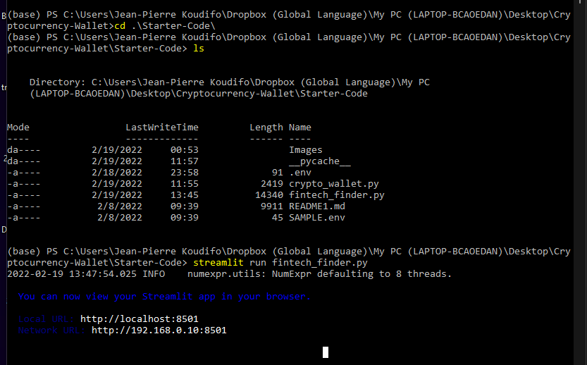
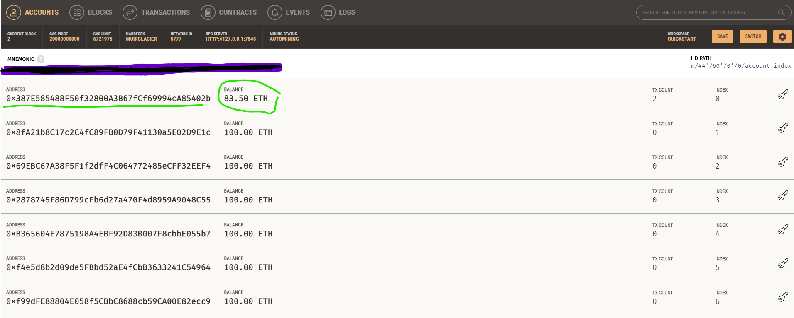

# Cryptocurrency Wallet - Challenge assignment.

#

##  Launch of the Streamlit application from the Terminal (screenshot)

# 

# 

## Resulting Streamlit webpage: Fintech Finder App! (screenshot)

# 

## Testing,  Signing and Executing Hiring and Payment Transaction (screenshot)

# 

A Fintech Professional Ash is hiring due to his rating  for 48hrs for an upcoming project at 0.33 Ether per hour making the total cost for the project to 15.86 ether. We have a balance of 100 eth in Garnach to exevcute this transaction. 

## Fintech Professional hired Profile 

Name : Ash
Ethereum Account Address: 0x2422858F9C4480c2724A309D58Ffd7Ac8bF65396
FinTech Finder Rating: 5.0
Hourly Rate per Ether: 0.33 eth

#

## Transaction details on Ganache (screenshot)
# 

Total cost for the project paid to Ash is 15.86 ETH. We have a remaining  balance of 83.50 ETH in Garnach after  executing  the transfer.
# 

